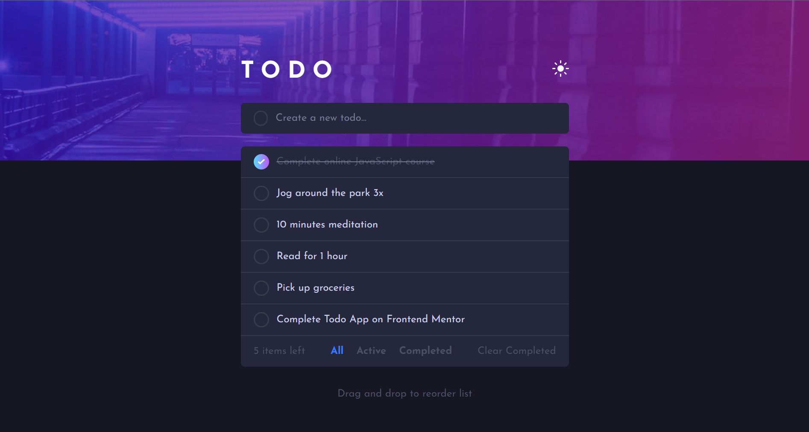
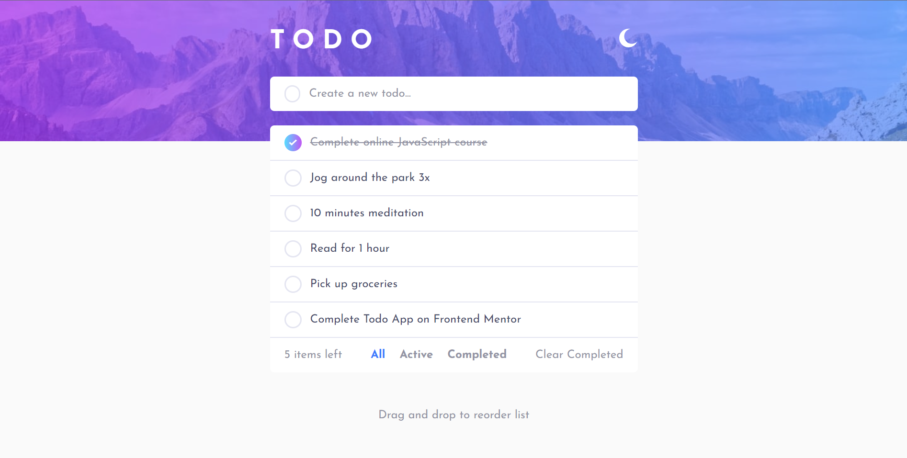

# Todo App with Drag and Drop Functionality

This is a simple Todo app built using HTML, Tailwind CSS, and JavaScript. The app allows you to manage your tasks by adding, deleting, and marking them as completed.

## Screenshots

_Dark Theme_

_Light Theme_

## Live Site

Check out the live site [here](https://calculat0r-4pp.netlify.app/).

## Features

- Add new tasks to your list.
- Delete tasks that you no longer need.
- Mark tasks as completed.
- Drag and drop tasks to reorder them.
- Filter tasks by All, Active, and Completed tabs.
- Toggle between light and dark themes for a personalized experience

## Installation

1. Clone the repository: `git clone https://github.com/your-username/calculator.git`
2. Navigate to the project directory: `cd calculator`
3. Install the dependencies: `npm install`
4. Start the development server: `npm run dev`
5. Open your web browser and visit `http://localhost:3000` (or the specified port)

## Contributing

Contributions are welcome! If you would like to contribute to this project, please follow these steps:

1. Fork the repository.
2. Create a new branch for your feature or bug fix.
3. Commit your changes.
4. Push your branch to your forked repository.
5. Submit a pull request.

## License

This project is licensed under the [MIT License](LICENSE).
